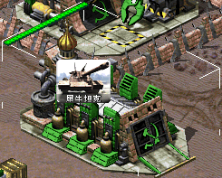

# 间谍效果

《尤里的复仇》只允许间谍在渗透时达到一种效果，这是由硬编码的优先顺序决定的。间谍渗透逻辑在Ares中被重写，变得更加灵活，包括间谍可以实现的一些新效果。

以下所有标志默认为 *no* 或 *0*。

*0.1 版中的新功能。*

`[BuildingType]►SpyEffect.Custom=` **（boolean）**

是否使用Ares间谍渗透逻辑，而不是原来的《尤里的复仇》逻辑。

> **注意**
>
> 必须设置为 *yes*，以下任何效果才能正常工作……

## 雷达

`[BuildingType]►SpyEffect.ResetRadar=` **（boolean）**

渗透这个敌人的建筑物是否会导致正常的雷达破坏行为（即，将敌人的地图重置黑幕到只剩他们目前可以看到的地形）。

`[BuildingType]►SpyEffect.RevealRadar=` **（boolean）**

**新效果** 渗透这个敌方雷达，会向渗透的玩家揭示所有进一步的单位移动。然后，敌方单位将像自己的单位一样侦察地图，直到渗透的建筑物被摧毁，出售或占领。建筑物还必须设置 `Radar=yes`。

`[BuildingType]►SpyEffect.KeepRadar=` **（boolean）**

**新效果 **如果启用，渗透此建筑物的玩家仍然可以访问拥有该建筑的玩家雷达，即使该建筑被摧毁，出售或占领。否则，间谍效果将被删除。建筑需要 `SpyEffect.RevealRadar=yes` 和 `Radar=yes` 。

## 电力

`[BuildingType]►SpyEffect.PowerOutageDuration=` **（integer - frames）**

敌人的电力将被破坏的帧数（即暂时减少到零）。

## 钱

最终从敌人那里偷来的钱的数量总是以他们目前拥有的金额为上限。

`[BuildingType]►SpyEffect.StolenMoneyPercentage=` **(float - percentage)**

在渗透此敌方建筑时，从敌人当前点数里窃取的百分比。默认值为 *0%*。

`[BuildingType]►SpyEffect.StolenMoneyAmount=` **（integer - credits）**

**新效果** 在渗透这个敌方建筑时，将从敌人那里偷走的固定数量的点数。默认值为 *0*。

如果与`SpyEffect.StolenMoneyPercentage`一起使用，则定义了能窃取的最大金额。

> **快速入门**
>
> 如果你想表达“拿走敌人四分之三的钱，但不超过10，000个点数”，请使用两个标签：`SpyEffect.StolenMoneyPercentage=75%`和`SpyEffect.StolenMoneyAmount=10000`。

## 超级武器

`[BuildingType]►SpyEffect.ResetSuperweapons=` **（boolean）**

渗透这个敌方建筑，导致所有附着在它上面的超级武器（`SuperWeapon`, `SuperWeapon2`, `SuperWeapons`和所有附着的建筑升级的超级武器）重新倒计时。

以下标签可用于获取超级武器，就像《红色警戒》中间谍渗透潜艇基地获得声纳脉冲。

`[BuildingType]►SpyEffect.SuperWeapon=` **（SuperWeaponType）**

**新效果** 在潜入这种类型的敌人建筑时，会授予这种超级武器。注意并非所有超级武器类型都受支持。

`[BuildingType]►SpyEffect.SuperWeaponPermanent=` **（boolean）**

授予的超级武器是否能永久可用。如果是，它将在不充能的情况下可用，并且发射后也不会丢失。否则，超级武器将在预充能后可用，但在发射一次后再次消失。默认值为 *no*。

*版本 0.B 中的新功能。*

## 窃取科技

`[BuildingType]►SpyEffect.StolenTechIndex=` **（integers list）**

在渗透这个敌人的建筑物时可窃取科技种类。仅支持 0 到 31（含）之间的值。使用 *-1* 禁用该效果。默认值为 *-1*。

> **注意**
>
> 请注意，尽管其名称为单数，但此标签采用整数列表，因此在渗透单个建筑物时可能会窃取多种科技类型。

`[TechnoType]►Prerequisite.StolenTechs=` **(list of integers)**

在建造此对象之前必须窃取的可窃取科技种类的列表。仅支持 0 到 31（含）之间的值。使用 *-1* 禁用此要求。默认值为 *-1*。

在《尤里的复仇》中，只有三种类型的可窃取科技可用，这些科技被硬编码到`[AI]►BuildTech`列表中的前三座建筑物中（游戏默认值如括号所示表示）：

- 渗透第一个（`GATECH`）满足`RequiresStolenAlliedTech=yes`
- 渗透第二个（`NATECH`）满足`RequiresStolenSovietTech=yes`
- 渗透第三个（`YATECH`）满足`RequiresStolenThirdTech=yes`

在 Ares 中，渗透 `SpyEffect.StolenTechIndex=2`（例子）建筑可以满足需要窃取科技 2 的单位的窃取科技要求。

> **注意**
>
> 如果您在`BuildTech`列表中的建筑物（如`GATECH`，`NATECH`或`YATECH`）上设置`SpyEffect.Custom=yes`，那么这些建筑物将不再满足旧的 `RequiresStolen*Tech`标志。

*在版本 0.B 中更改。*

## 老兵等级

Ares添加了五个独立的微观控制，通过间谍来获得老兵等级，因此可以同时授予一种或多种类型的老兵等级，而原始游戏仅支持*InfantryType*或*VehicleType*，具体取决于 `Factory=` 设置。

`[BuildingType]►SpyEffect.InfantryVeterancy=` **（boolean）**

渗透这座建筑是否会让你未来所有从自己的工厂建造的有`Trainable=yes`的步兵，以老兵为初始等级。默认值为 *no*。

`[BuildingType]►SpyEffect.VehicleVeterancy=` **（boolean）**

渗透这座建筑是否会让你未来所有从自己的工厂建造的有`Naval=no`和`Trainable=yes`的载具，以老兵为初始等级。默认值为 *no*。

`[BuildingType]►SpyEffect.NavalVeterancy=` **（boolean）**

**新效果 **渗透这座建筑是否会让你未来所有从自己的工厂建造的有`Naval=yes`和`Trainable=yes`的载具，以老兵为初始等级。默认值为 *no*。

`[BuildingType]►SpyEffect.AircraftVeterancy=` **(boolean)**

**新效果** 渗透这座建筑是否会让你未来所有从自己的工厂建造的有`Trainable=yes`的飞行器，以老兵为初始等级。默认值为 *no*。

`[BuildingType]►SpyEffect.BuildingVeterancy=` **（布尔值）**

**新效果** 渗透这座建筑是否会让你未来所有从自己的建造场建造的有`Trainable=yes`的建筑，以老兵为初始等级。默认值为 *no*。

*0.1 版中的新功能。*

*在 2.0 版更改。*

## 情报

`[BuildingType]►SpyEffect.RevealProduction=` **（boolean）**

**新效果** 渗透这个敌方建筑，你都可以看到敌人目前从那个工厂建造的东西，或者电力输出，或者拥有者的钱。一旦建筑被渗透，选择建筑物，正在生产的单位的信息将显示在建筑物上。

`Fake=yes` 建筑物将显示文本*TXT_FAKE*，并在工具提示中显示其真实名称（请参阅 [*EnemyUIName*](../enemyuiname.html))

`Power`大于 0 的建筑将显示电力等级（使用*TXT_POWER_DRAIN2*)

`Storage` 大于0 的建筑将显示玩家的点数（使用*TXT_MONEY_FORMAT_1*)

`Factory`建筑将揭示当前生产物的图标

> **注意**
>
> 已使观战者始终能够获取此类信息。

*在版本 0.B 中更改。*

## 逆向工程

重置玩家通过[*逆向工程*](../reverseengineerlogic.html)获得的建造选项。

`[BuildingType]►SpyEffect.UndoReverseEngineer=` **（boolean）**

**新效果** 渗透这座建筑是否会消除被渗透玩家目前为止逆向获得的所有科技。默认值为 *no*。

*0.2 版中的新功能。*

## 破坏

`[BuildingType]►SpyEffect.SabotageDelay=` **（integer - frames）**

此数量的帧数之后，之后建筑将被破坏，就好像安装了C4一样。如果为负数，则使用 `[CombatDamage]►C4Delay`。使用 *0* 禁用。默认值为 *0*。

*版本 0.E 中的新功能*