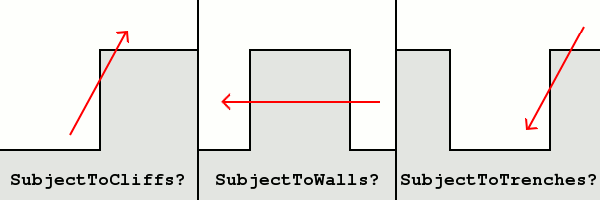
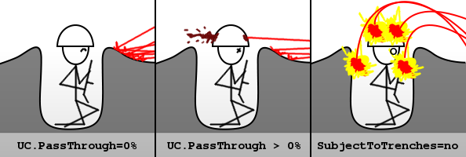

# 巷战 - 战壕

本节介绍了几个一起设计的新功能，以便允许模组作者向游戏添加可占领的战壕。这些功能不必一起使用来实现战壕 - 每个功能都设计为可自定义并且可以单独使用。

> **注意**
>
> 这意味着这些单独的要素无法区分作为战壕的建筑物和不作为战壕的建筑物。了解每个新标志的工作原理非常重要 - 无论是单独使用还是与其他与战壕相关的标志结合使用。

## 穿透

巷战建筑现在可以指定针对它们的攻击的百分比将“穿透”到内部的占据者 - 伤害它们而不是建筑本身。

`[BuildingType]►UC.PassThrough=` **(float - chance)**

将穿透并射中占据者的射击的百分比（因此不会伤害此建筑物）。默认值为 *0%*（即所有射击都会伤害建筑物/没有射击会伤害占据者）。当里面没有占据者时，`UC.PassThrough`将被忽略（即所有射击都会伤害建筑）。

`[BuildingType]►UC.PassThrough=` **(float - chance)**

如果一枪已经穿透，这些子弹将完全无视武器立即杀死一名占据者的百分比。默认值为 *0%*。

`[BuildingType]►UC.DamageMultiplier=` **(float - multiplier)**

如果一枪已经穿透，但不一定是致命的，那么一名占据者将受到伤害。武器造成的伤害将乘以`UC.DamageMultiplier`。默认为*100%*（即武器造成的伤害没有变化）。

`[Projectile]►SubjectToTrenches=` **(boolean)**

这个抛射体是否会覆盖正常的目标建筑物上的*UC.PassThrough*概率。如果射弹设置有 `SubjectToTrenches=no`，并且目标建筑设置有 `UC.PassThrough `大于零，则当被这个射弹击中时建筑物将被视为具有`UC.PassThrough=100%`。如果设置`了 SubjectToTrenches=yes`（默认值），则当建筑物被此射弹击中时，将使用正常的 `UC.PassThrough`概率。

`SubjectToTrenches`非常适用于战壕 - 例如，掷弹兵很容易将手榴弹放入开放的战壕中，因此肯定会伤害占据者。

> 注占据者意
>
> 如果你不考虑战壕，`SubjectToTrenches`这个名字是误导性的。这对所有使用 `UC.PassThrough` > 0%的可占用建筑物都有影响。

*0.1 版中的新功能。*

## 夺取掩体的权利

例如，您现在可以指定战斗掩体可以被敌方步兵占领，只需让他们走进并驻守建筑物，就好像它是他们自己的建筑物一样。

`[BuildingType]►Bunker.Raidable=` **(boolean)**

这座建筑是否可以由敌方玩家的步兵驻守，前提是该建筑尚未被占据。

如果设置了 `Bunker.Raidable=yes` 并且建筑物是空的，则该建筑物可以由任何玩家的步兵驻守。当另一个玩家驻守建筑物时，所有权将转移给该玩家。此时，建筑物只能由部队在里面的玩家进一步驻守。如果占据者离开建筑物，则该建筑物的所有权将转移回其原始所有者。由于建筑由不是“真正”所有者的玩家持有，此时该建筑不能出售。

*0.1 版中的新功能。*

## 进阶废墟

如果你真的用力击中一条壕沟来摧毁它，你只是在做两件事之一；要么你把一个小洞变成一个大洞，要么你让它坍塌。无论哪种方式，你都不会真正从战场上移除战壕——只是让它无法使用。在那里重新挖掘战壕比在未受破坏的土壤上更容易，另一方面，你不能像什么都没发生过一样在那里建造。

请注意，工程师不会被此修复过程“耗尽”——他们将现有保留在沟槽之外。这非常适用于战壕：工程师不会修理/重建整个建筑物，只需重新挖掘战壕，这样他的工作就不会太累人。

> 注意
>
> Ares 强制执行 `Rubble.Destroyed=` 和 `Rubble.Intact=` 的占地，以匹配原始 *BuildingType* 的占地。自定义占地与内置占地不匹配。如果您不遵守此要求，将引发致命错误，游戏将退出。

进阶废墟的实现方式与Ares中的其他升级系统类似。第一组用于将建筑转换为废墟：

`[BuildingType]►Rubble.Destroyed=` **(BuildingType)**

此*BuildingType*将在摧毁时转换为的新*BuildingType*。默认情况下，将以最大`Strength`创建建筑。工程师将始终在建筑上显示光标 *RepairTrench*。

通过*Rubble.Destroyed*被用作废墟的建筑，被摧毁的建筑不允许被占领或有任何类型的乘客。不支持可占领的废墟。

警告

不要使用 `Rubble.Destroyed`套娃。这可能会导致游戏卡死。建筑不能是自己的废墟，也不能直接或间接地覆盖一个或多个其他*BuildingType*。

`[BuildingType]►Rubble.Destroyed.Remove=` **(boolean)**

建筑是否应该消失而不是被改造成废墟。覆盖`Rubble.Destroyed`。默认值为 *no*。

`[BuildingType]►Rubble.Destroyed.Owner=` **(enumeration default|civilian|special|neutral)**

废墟建筑将属于的国家。默认为当前所有者，*civilian*是称为*Civilian*的阵营的第一个国家，*special*和*neutral*分别是分别命名为*Special*和*Neutral*的国家。默认值为*default*。

`[BuildingType]►Rubble.Destroyed.Strength=` **(integer)**

废墟建筑的生命值。正值直到`Strength`将会直接使用。负值直到*-99*是满生命值的百分比，*-1*表示生命值的1%所有的其他值表示满生命值。默认同`Strength`。

`[BuildingType]►Rubble.Destroyed.Anim=` **(AnimationType)**

当建筑物转换为废墟或被移除时播放的动画。默认值为*none*。

还有第二组标签用于从废墟中恢复建筑物，和第一组标签相呼应：

`[BuildingType]►Rubble.Intact=` **(BuildingType)**

此*BuildingType*在修复时将转换为的新*BuildingType*。除非另有设置，否则修复后的建筑物将以1%的`Strength`创建。

`[BuildingType]►Rubble.Intact.Remove=` **(boolean)**

当工程师进入时，建筑物是否应该移除而不是恢复。覆盖`Rubble.Intact`。默认值为 *no*。

`[BuildingType]►Rubble.Intact.Owner=` **(enumeration default|civilian|special|neutral)**

恢复的建筑物将属于的国家。默认为当前所有者，*civilian*是称为*Civilian*的阵营的第一个国家，*special*和*neutral*分别是分别命名为*Special*和*Neutral*的国家。默认值为*default*。

`[BuildingType]►Rubble.Intact.Strength=` **(integer)**

恢复的建筑的生命状况。正值直到`Strength`将会直接使用。负值直到*-99*是满生命值的百分比，*-1*表示生命值的1%所有的其他值表示满生命值。默认同`Strength`。

`[BuildingType]►Rubble.Intact.Anim=` **(AnimationType)**

恢复或移除建筑物时播放的动画。默认值为*none*。

*0.1 版中的新功能。*

*在 0.8 版更改。*

## 穿越战壕

战壕的一个主要概念是步兵从战壕的一段移动到下一段的能力，其基础是相邻的战壕是相连的，本质上是相同的战壕。

战壕建筑必须有一个接一个的占地，否则它们将无法正常工作。

`[BuildingType]►IsTrench=` **(string - trench type ID)**

指定此特定战壕的唯一名称，以便游戏知道它是用于遍历目的的战壕，并允许占据者在同种战壕的段之间转移。

例如，假设你有`IsTrench=AlliedModern`。这条战壕有两段彼此相邻，其中一段驻扎着。如果选择驻留区段，然后将鼠标光标放在相邻段上，则会在相邻段上显示一个“enter”光标。现在用“enter”光标单击，将占据者从驻军区段转移到相邻区段。

> **注意**
>
> （目前）`IsTrench`逻辑没有使用特殊的图像处理；你不会得到比如说墙壁或激光围栏那样有适当的连接/封闭的末端漂亮的一排战壕。

*0.1 版中的新功能。*

## 指定建筑物的占据者

现在，您可以指定允许哪些步兵进入建筑物。

`[BuildingType]►CanBeOccupiedBy=` **(list of InfantryTypes)**

列出允许进入此建筑物的单位。需要`CanBeOccupied=yes` 和步兵的 `Occupier=yes`。

*0.2 版中的新功能。*