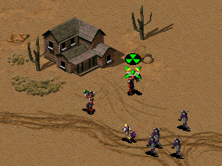
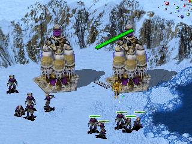
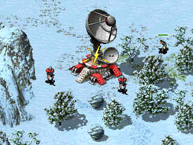

# 单位和建筑的光标

可以为每个单元或建筑自定义光标，以赋予它们独特的外观，或者比通用光标更好地表达特殊功能。

所有这些设置都采用在“鼠标光标”下定义的命名[*光标*](mousecursors.html)。另请参阅如何使用[*自定义武器光标*](weapons/cursors.html)。

## 运动

这些光标用于各种功能：设置工厂的集结点，取消部署以及给出单位移动命令，但它们也可以用作其他无法使用的功能的提示，例如当目标无法攻击或无法进入对象时。

`[TechnoType]►Cursor.Move=` **(mouse cursor)**

用于表示移动操作的光标。默认值为*Move*。

`[TechnoType]►Cursor.NoMove=` **(mouse cursor)**

用于表示无法执行移动操作的光标。默认为*NoMove*。

## 部署

部署光标用于各种不同的功能，例如部署建筑，弹出乘客和驻军，清空掩体，部署大兵或辐射工兵，以及命令尤里复制人区域攻击（指心灵波）。

`[TechnoType]►Cursor.Deploy=` **(mouse cursor)**

用于部署动作的光标。默认值为*Deploy*。

`[TechnoType]►Cursor.NoDeploy=` **(mouse cursor)**

用于指示建筑物无法部署、乘客无法离开或自动取消部署的步兵处于部署状态（尤里复制人部署后的僵直状态）的光标。默认值为*NoDeploy*。

## 进入

与其他光标不同，使用鼠标悬停在其上的对象的回车光标。*Enter* 光标表示几个不同的操作。例如，用于进入坦克掩体（`Bunker=yes`），生物反应堆（`InfantryAbsorb=yes`和/或`UnitAbsorb=yes`），部队回收厂（`Grinder=yes`），维修厂或机场（`UnitRepair=yes`）或进入运输工具。

请注意，不能使用以下光标自定义某些操作。尽管光标是进入光标，但进入可驻军建筑实际上是一种捕获操作。间谍进入可以使用下面的设置进行自定义。此外，破坏者和劫持者的进入操作也用专用光标表示。

`[TechnoType]►Cursor.Enter=` **(mouse cursor)**

选中其他对象将鼠标悬停在此类对象上时，将获得的进入光标。默认为 *Enter*。

`[TechnoType]►Cursor.NoEnter=` **(mouse cursor)**

选中其他对象将鼠标悬停在此类对象上但无法进入时获得的光标。所有运输工具都会使用。默认为*NoEnter*。

## 间谍渗透

间谍光标可以针对每种建筑种类进行自定义，因此 `Agent=yes` 步兵可以获得一个光标，该光标在渗透时可能会根据该建筑种类的间谍效果进行定制。

`[BuildingType]►Cursor.Spy=` **(mouse cursor)**

间谍渗透到此类建筑物中显示的光标。默认值为 *Enter*。