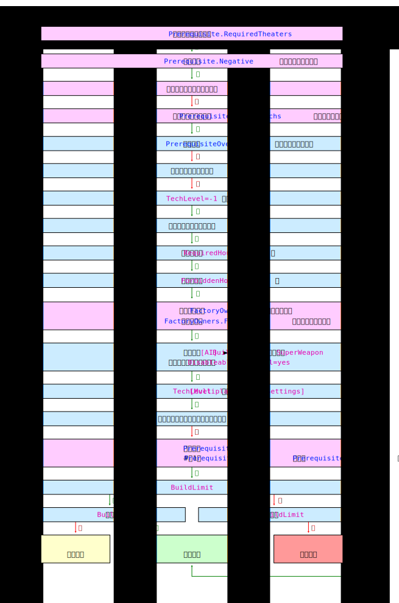

# 前置需求

前置需求系统已通过多种方式得到增强。下面介绍了新标志，并且已解决有关建筑升级作为前置需求的问题（请参阅 [*BuildingType 升级不是可行的前置需求*](../bugfixes/type2/buildingtypeupgradesarenotviableprerequisites.html)）。


## 需要作战地区

译者注：theater n.剧院;剧场;戏剧;战场;(某一国,某一作家的)戏剧作品

`[TechnoType]►Prerequisite.RequiredTheaters=` **(list of theater names)**

提供该科技种类的地图作战地区。默认为所有作战地区。例如，如果仅指定了 *SNOW*（雪地）作战地区，则该类型将仅在极地地图上可用。例如，这允许您实现海豹突击队上使用的`AlternativeArcticArt`功能，但适用于所有类型和所有战区（但是这可能会给您的AI带来挑战）。作战地区名称是：

- *TEMPERATE* - 大部分地图
- *SNOW* - 极地/雪地地图
- *URBAN* - 一些城市地图
- *DESERT* - 一些沙漠地图，旧一点的沙漠地图用的是*TEMPERATE*
- *LUNAR* - 苏联战役第六关
- *NEWURBAN* - 大部分YR城市地图

> **注意**
>
> `PrerequisiteOverride`不覆盖 `Prerequisite.RequiredTheaters`。

*0.1 版中的新功能。*


## 反前置需求

`[TechnoType]►Prerequisite.Negative=` **(list of BuildingTypes)**

阻止建造该科技种类的建筑。如果玩家拥有此列表中的一个或多个建筑物，则该种类将不可用。默认值为*none*。

> **注意**
>
> `PrerequisiteOverride` 不覆盖 `Prerequisite.Negative`。

*0.1 版中的新功能。*


## 多个备选前置需求列表

Ares 支持多个前置需求列表。每个前置需求列表都充当现有` Prerequisite `标志的独立副本，并且必须至少满足一个前置需求列表，此类型才能成为可生成类型。

例如，如果您设置了`Prerequisite=GAPILE,GATECH`和`Prerequisite.List1=NAHAND,NATECH`，那么该对象将可供任何同时拥有盟军兵营和作战实验室或苏联兵营和作战实验室的玩家使用。

> **注意**
>
> 必须指定 `Prerequisite` 或 `Prerequisite.List0` ，因为这些只是**附加**列表，并且仍使用原始前置需求列表。如果忽略这一点并将列表留空，则对象将始终可建造，因为始终满足空列表。

`[TechnoType]►Prerequisite.Lists=` **(integer)**

指定有多少个额外的前置需求列表与一个默认列表相辅相成。默认值为 0。

`[TechnoType]►Prerequisite.List#=` **(list of BuildingTypes (从1开始的前置需求列表索引, 最大值由Prerequisite.Lists指定))**

满足此前置需求所需的建筑种类（*BuildingTypes*）列表。每个列表都单独检查，如果满足任意列表，则满足前置需求要求。

> **注意**
>
> `Prerequisite.List0`（如果指定了）将覆盖现有的`Prerequisite`标志。

*0.1 版中的新功能。*


## 需要窃取技术

`[TechnoType]►Prerequisite.StolenTechs=` **(list of integers)**

在建造此对象之前必须窃取的可窃取技术类型的列表。有关详细信息，请参阅[窃取技术](buildings/spyeffects.html#spybehavior-stolentech)。

*0.1 版中的新功能。*


## 需要特定国家建造的工厂

满足前置需求可以与工厂建筑的初始所有者相关联。最初的所有者是首先拥有它的玩家：建造它的玩家，或者预先放置在地图上的建筑的所有者。对于neutral（中立）建筑，将是neutral国家。

`[BuildingType]►FactoryOwners.HasAllPlans=` **(boolean)**

该建筑是否为初始所有者的所有工厂种类提供图纸。如果是*yes*，则此建筑满足所有对象类型的工厂所有者要求。失去建筑物将失去图纸。默认为 *no*。

译者注：占领后暂时获取工厂对应的科技，失去建筑后失去科技

`[BuildingType]►FactoryOwners.Permanent=` **(boolean)**

玩家占领这种建筑物将永久获得其初始所有者的所有图纸。支持建筑升级。默认值为 *no*。

译者注：占领后永久获取工厂对应的科技

`[TechnoType]►FactoryOwners=` **(list of houses)**

其工厂可以建造此对象的国家列表。如果为空，则允许所有国家生产此对象。否则，玩家需要拥有此列表中的某个国家建造的至少一家工厂，或者至少一个国家的图纸来生产它。

`[TechnoType]►FactoryOwners.Forbidden=` **(list of houses)**

其工厂无法构建此对象的国家列表。仅拥有此列表中的国家建造的工厂并且仅拥有这些国家的图纸的玩家将无法生产它。

注意

AI建造建筑时无视 `FactoryOwners`  `FactoryOwners.Forbidden` ，但建造单位正常。

*0.6 版中的新功能。*

*在 2.0 版更改。*

## 概述

以下是当前前置需求系统的流程图。蓝色部分与原始系统相同。粉色部分已被Ares修改或添加。



## 通用前置需求组

您现在可以创建自定义通用前置需求组，如现有的 *POWER*（`PrerequisitePower`）、*FACTORY*（`PrerequisiteFactory`）、*BARRACKS*（`PrerequisiteBarracks`）、*RADAR*（`PrerequisiteRadar`）、*TECH*（`PrerequisiteTech`）和 *PROC* （`PrerequisiteProc`和`PrerequisiteProcAlternate`）组。

要创建新组，只需新增 `[GenericPrerequisite] `节，并添加格式为 `GROUPNAME=`(list of BuildingTypes)的标志。例如：

```ini
[GenericPrerequisites]
NAVALYARD=GAYARD,NAYARD,YAYARD
等等...
```
```ini
[TechnoType]
...
Prerequisites=NAVALYARD
...
```

如果声明任何现有组（*POWER/FACTORY/BARRACKS/RADAR/TECH/PROC*），则将使用 `[GenericPrerequisite]` 部分中指定的建筑种类，而不是在原始 *PrerequisiteGroup* 标志上指定的建筑类型（即 `[GenericPrerequisite]►POWER=`，如果指定，将覆盖 `[General]►PrerequisitePower=`)。请注意，`[GenericPrerequisites]►PROC=` 不会覆盖或取消 `[General]►PrerequisiteProcAlternate=`。

*0.1 版中的新功能。*


## 非建筑物的备用前置需求

为了支持奴隶矿厂作为前置需求，《尤里的复仇》增加了一个选项，通过拥有已部署的建筑物或未部署的奴隶矿工车辆来满足*PROC*的要求。这仅通过添加`[General]►PrerequisiteProcAlternate=`，把一个载具种类、作为精炼厂组实现。

Ares 为所有通用前置需求组添加了备用前置需求支持，并扩展了此功能以支持任意技术类型的多个项目。

`[General]►PrerequisiteXAlternate=` **(list of TechnoTypes)**

如果玩家不拥有 `[General]►PrerequisiteX=`列表中的建筑，则这些类型可以替代满足此要求。将 `X` 替换为 `[GenericPrerequisites]` 中的键，第一个字符大写，所有其他字符都小写。例如，上面的NAVALYARD将成为*Navalyard*。

> **注意**
>
> 不支持使用 *BuildingTypes*，在此处添加它们可能会产生意外结果。例如，建筑升级将不起作用。

*版本 0.B 中的新功能。*